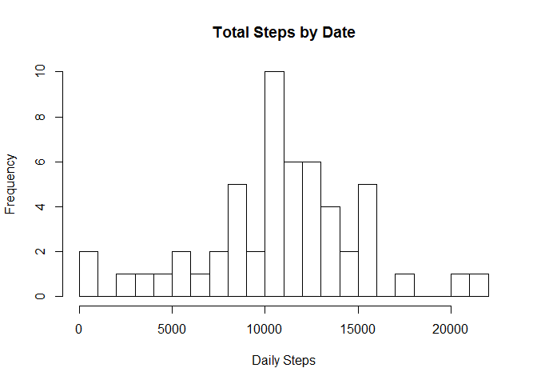
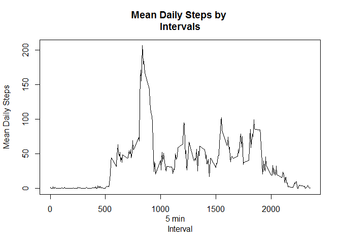
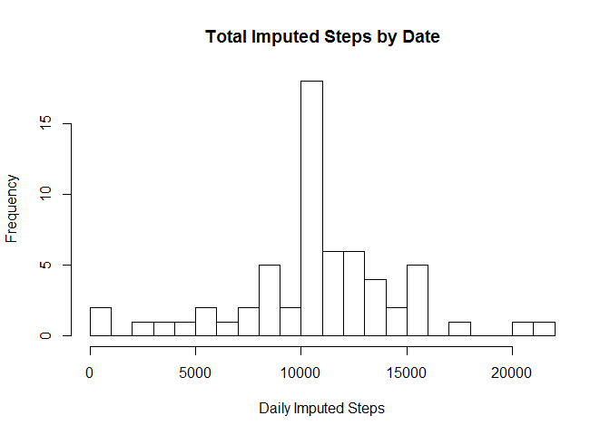
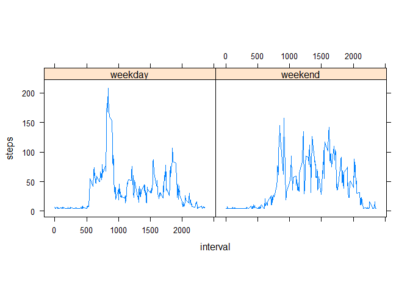

# Reproducible Research: Peer Assessment 1


## Loading and preprocessing the data
   set up working directory
   unzip activity file and read it to R
   
   ```r
   unzip("./activity.zip")
   data <- read.csv("./activity.csv")
   str(data)
   ```
   
   ```
   ## 'data.frame':	17568 obs. of  3 variables:
   ##  $ steps   : int  NA NA NA NA NA NA NA NA NA NA ...
   ##  $ date    : Factor w/ 61 levels "2012-10-01","2012-10-02",..: 1 1 1 1 1 1 1 1 1 1 ...
   ##  $ interval: int  0 5 10 15 20 25 30 35 40 45 ...
   ```
   
   ```r
   head(data)
   ```
   
   ```
   ##   steps       date interval
   ## 1    NA 2012-10-01        0
   ## 2    NA 2012-10-01        5
   ## 3    NA 2012-10-01       10
   ## 4    NA 2012-10-01       15
   ## 5    NA 2012-10-01       20
   ## 6    NA 2012-10-01       25
   ```
## What is mean total number of steps taken per day?
   Convert date to POSIXct class 
   
   ```r
   library(lubridate)
   ```
   
   ```
   ## 
   ## Attaching package: 'lubridate'
   ```
   
   ```
   ## The following object is masked from 'package:base':
   ## 
   ##     date
   ```
   
   ```r
   data$date <- ymd(data$date)
   str(data)
   ```
   
   ```
   ## 'data.frame':	17568 obs. of  3 variables:
   ##  $ steps   : int  NA NA NA NA NA NA NA NA NA NA ...
   ##  $ date    : Date, format: "2012-10-01" "2012-10-01" ...
   ##  $ interval: int  0 5 10 15 20 25 30 35 40 45 ...
   ```
   
   Tatal steps daily 
   
   ```r
   datatotal <- aggregate(steps ~ date, data, sum)
   str(datatotal)
   ```
   
   ```
   ## 'data.frame':	53 obs. of  2 variables:
   ##  $ date : Date, format: "2012-10-02" "2012-10-03" ...
   ##  $ steps: int  126 11352 12116 13294 15420 11015 12811 9900 10304 17382 ...
   ```
   
   Calculate and report the mean and median
   
   ```r
   meansteps <- mean(datatotal$steps)
   meansteps
   ```
   
   ```
   ## [1] 10766.19
   ```
   
   ```r
   median(datatotal$steps)
   ```
   
   ```
   ## [1] 10765
   ```
   
   Make a histogram of daily steps 
   
   ```r
   hist(datatotal$steps, breaks = 20, xlab = "Daily Steps", ylab = "Frequency",    main = "Total Steps by Date")
   ```
   
   <!-- -->
   
## What is the average daily activity pattern?
   average steps in 5 intervail for all days
   
   ```r
   averagesteps <- aggregate(steps ~ interval, data, mean)
   str(averagesteps)
   ```
   
   ```
   ## 'data.frame':	288 obs. of  2 variables:
   ##  $ interval: int  0 5 10 15 20 25 30 35 40 45 ...
   ##  $ steps   : num  1.717 0.3396 0.1321 0.1509 0.0755 ...
   ```
   
   ```r
   plot(steps ~ interval, data = averagesteps, type = "l", xlab = "5 min     
   Interval", ylab = "Mean Daily Steps", main = "Mean Daily Steps by 
   Intervals")
   ```
   
   <!-- -->
   
   ```r
   print
   ```
   
   ```
   ## function (x, ...) 
   ## UseMethod("print")
   ## <bytecode: 0x0000000016d99478>
   ## <environment: namespace:base>
   ```
   
   Find max number of average steps across all days
   
   ```r
   maxsteps <- averagesteps[which.max(averagesteps$steps),1]
   maxsteps
   ```
   
   ```
   ## [1] 835
   ```
   
## Imputing missing values
   Count missing values (how many rows with NA)
   
   ```r
   sum(is.na(data$steps))
   ```
   
   ```
   ## [1] 2304
   ```
   
   replace missing values with mean 
   
   
   ```r
   library(Hmisc)
   ```
   
   ```
   ## Warning: package 'Hmisc' was built under R version 3.3.3
   ```
   
   ```
   ## Loading required package: lattice
   ```
   
   ```
   ## Loading required package: survival
   ```
   
   ```
   ## Warning: package 'survival' was built under R version 3.3.3
   ```
   
   ```
   ## Loading required package: Formula
   ```
   
   ```
   ## Loading required package: ggplot2
   ```
   
   ```
   ## Warning: package 'ggplot2' was built under R version 3.3.3
   ```
   
   ```
   ## 
   ## Attaching package: 'Hmisc'
   ```
   
   ```
   ## The following objects are masked from 'package:base':
   ## 
   ##     format.pval, round.POSIXt, trunc.POSIXt, units
   ```
   
   ```r
   newdata <- data
   newdata$steps <- with(newdata, impute(steps, mean))
   str(newdata)
   ```
   
   ```
   ## 'data.frame':	17568 obs. of  3 variables:
   ##  $ steps   :Class 'impute'  atomic [1:17568] 37.4 37.4 37.4 37.4 37.4 ...
   ##   .. ..- attr(*, "imputed")= int [1:2304] 1 2 3 4 5 6 7 8 9 10 ...
   ##  $ date    : Date, format: "2012-10-01" "2012-10-01" ...
   ##  $ interval: int  0 5 10 15 20 25 30 35 40 45 ...
   ```
   Tatal steps daily with new data
   
   ```r
   newdatatotal <- aggregate(steps ~ date, newdata, sum)
   str(newdatatotal)
   ```
   
   ```
   ## 'data.frame':	61 obs. of  2 variables:
   ##  $ date : Date, format: "2012-10-01" "2012-10-02" ...
   ##  $ steps: num  10766 126 11352 12116 13294 ...
   ```
   
   Ploting with new data
   
   ```r
   hist(newdatatotal$steps, breaks = 20,  xlab = "Daily Imputed Steps", ylab =  
   "Frequency", main = "Total Imputed Steps by Date")
   ```
   
   <!-- -->
   
   Calculate mean and median with new data
   
   ```r
   mean(newdatatotal$steps)
   ```
   
   ```
   ## [1] 10766.19
   ```
   
   ```r
   median(newdatatotal$steps)
   ```
   
   ```
   ## [1] 10766.19
   ```
   
   Analysis: The mean and median calculated from the imputed data were almost the same as the  mean and median from              origianl data.  
   
   
## Are there differences in activity patterns between weekdays and weekends?
   Assign weekday and weekend for imputed data
   
   ```r
   newdatawk <- newdata
   newdatawk$typeday <- as.factor(ifelse(weekdays(newdatawk$date) %in% c("Saturday", "Sunday"), "weekend", "weekday"))
   str(newdatawk)
   ```
   
   ```
   ## 'data.frame':	17568 obs. of  4 variables:
   ##  $ steps   :Class 'impute'  atomic [1:17568] 37.4 37.4 37.4 37.4 37.4 ...
   ##   .. ..- attr(*, "imputed")= int [1:2304] 1 2 3 4 5 6 7 8 9 10 ...
   ##  $ date    : Date, format: "2012-10-01" "2012-10-01" ...
   ##  $ interval: int  0 5 10 15 20 25 30 35 40 45 ...
   ##  $ typeday : Factor w/ 2 levels "weekday","weekend": 1 1 1 1 1 1 1 1 1 1 ...
   ```
   plotting
   Calculate daily steps 
   
   ```r
   meandailysteps <- aggregate(steps ~ interval + typeday, newdatawk, mean)
   library(lattice)
   xyplot(steps ~ interval | factor(typeday), data = meandailysteps, aspect = 0.8, type = "l")
   ```
   
   <!-- -->
   

